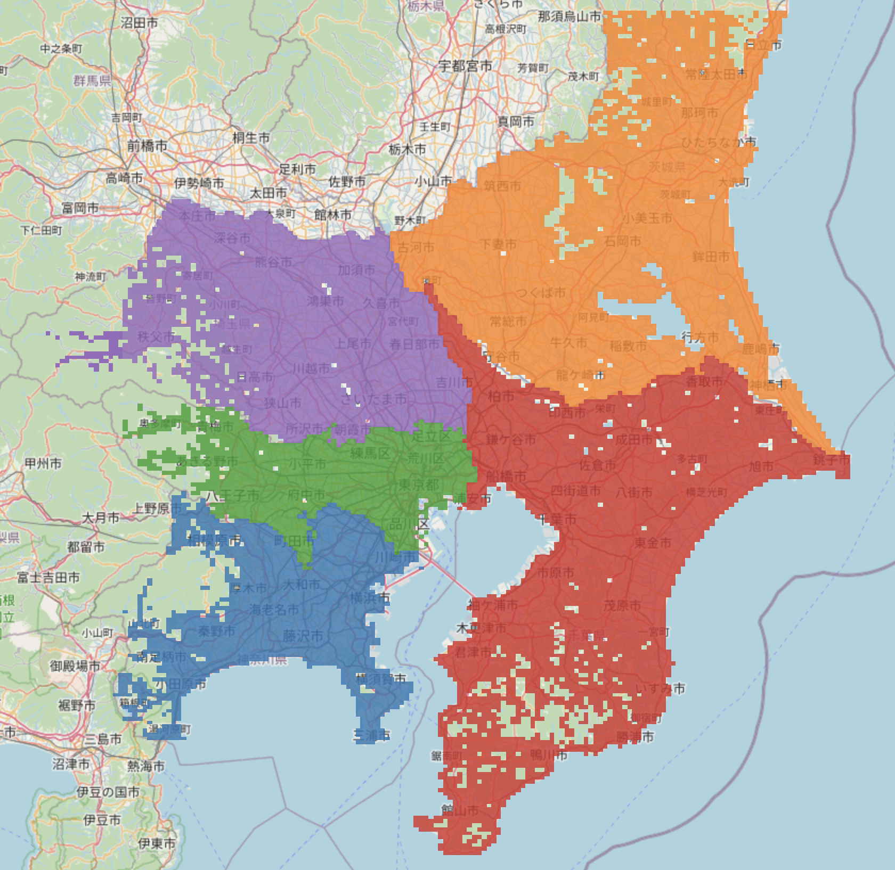
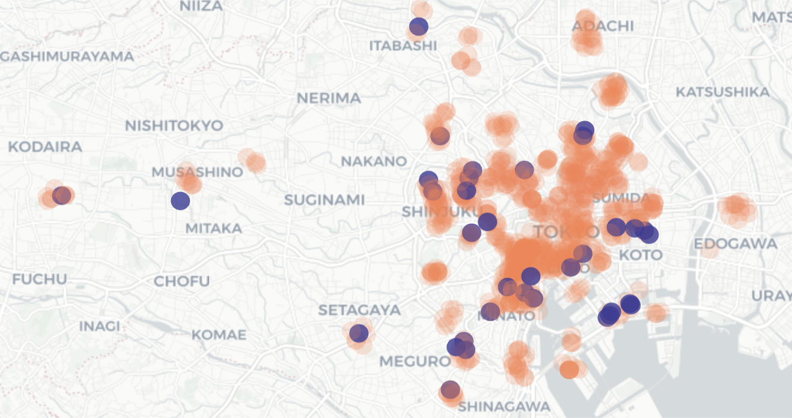
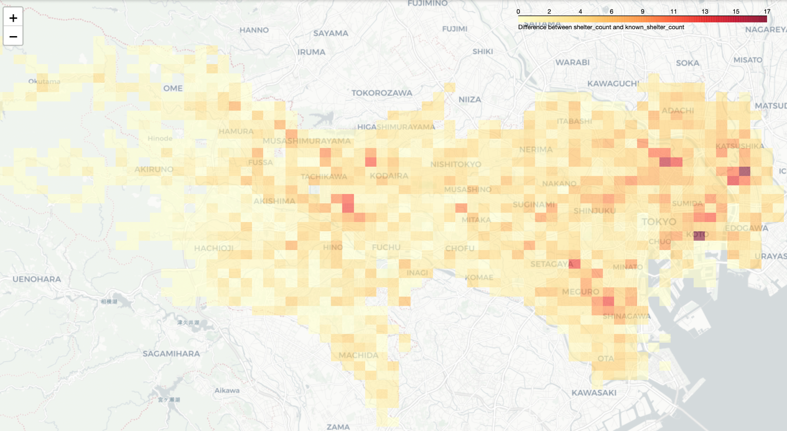
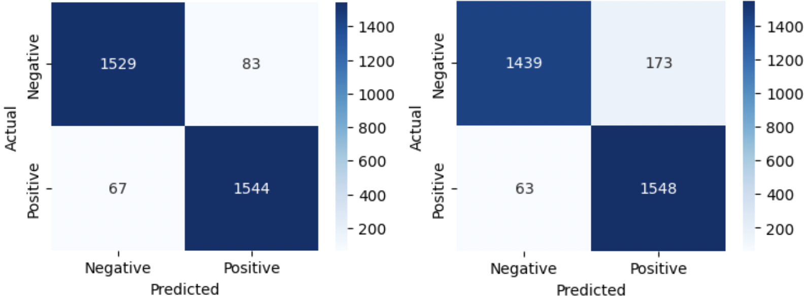
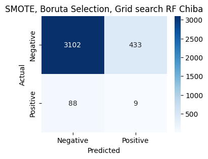
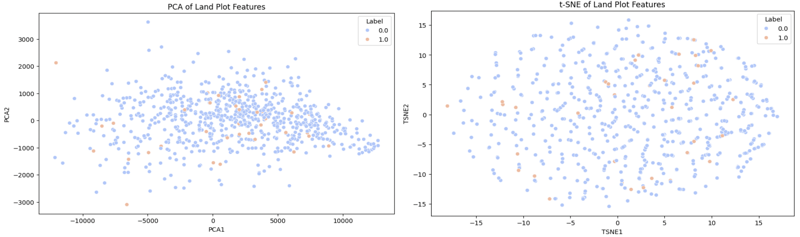
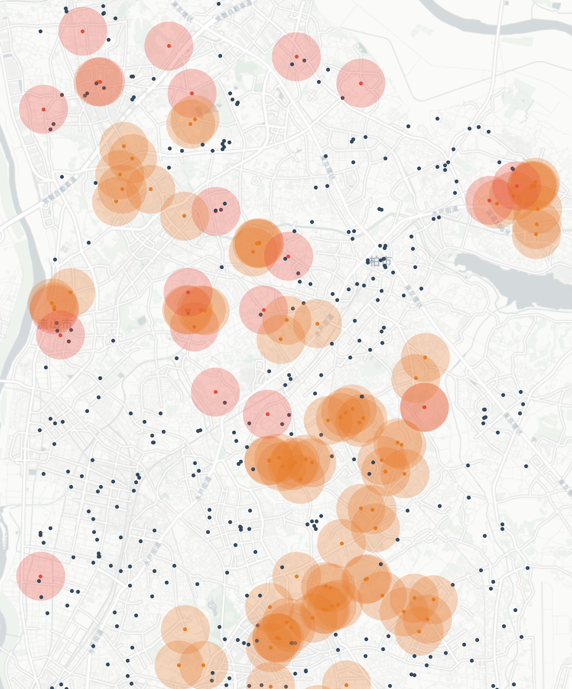

# Classifying the Feasibility of Public Facilities as Evacuation Shelters using Machine Learning

**ABSTRACT** Japan faces significant challenges in disaster preparedness due to its vulnerability to earthquakes and its aging, urbanized population. While urban regions typically have robust evacuation infrastructure, rural areas lag behind, necessitating a tailored approach to disaster management. This study introduces a machine learning-based recommendation system for designating public facilities as evacuation shelters, addressing these disparities.

The system employs two models: a convolutional neural network (CNN) to predict the number of shelters required per region and a classification model to identify suitable facilities. Training on Tokyo data and testing on Aichi prefecture demonstrated the CNN's high generalizability, achieving 99.64% accuracy. Classification models, leveraging Random Forest and XGBoost, identified shelter-capable facilities with a recall of up to 94.9%, though generalizability across regions was limited due to data imbalance and feature selection challenges. This framework represents a scalable solution for optimizing evacuation planning in diverse geographic settings.

## 1. Introduction

Japan, highly prone to natural disasters like earthquakes and tsunamis, faces significant evacuation challenges due to its aging population and urban concentration. Shelters are typically concentrated in densely populated urban areas, leaving rural regions underprepared (Akamatsu & Yamamoto, 2019). Existing studies have employed optimization algorithms to address the shelter shortage, but these solutions often fail to apply to rural regions, which require more tailored approaches due to infrastructural limitations (Xu et al., 2006; Sasaki et al., 2018).

This study introduces a machine learning-based recommendation system to designate public facilities as evacuation shelters. The system comprises two models: one predicts the required number of shelters in a given area, while the other identifies suitable public facilities. We validate the system's applicability by applying it to Tokyo and the adjacent semi-urban region of Northern Chiba.

## 2. Datasets

The primary dataset used comprises land usage and population demographic data organized by 1 km² "meshes." The data includes land allocations for various uses such as buildings, roads, and natural features, as well as population estimates segmented by age groups (MLITT, 2019). Distance to water bodies, relevant for potential flood zones, was calculated using the Haversine formula. The dataset features 26 factors used to train the models.

Public facility data was sourced from the Ministry of Land, Infrastructure, Transport, and Tourism (MLITT), containing over 14,000 facilities. Filtering was done based on criteria such as structural fireproofing and access to roads wider than 12 meters. A subset of these facilities was classified as potential shelters based on available data, resulting in 964 public facilities suitable for analysis.

<figure style="text-align: center;">
    
    <figcaption><em><b>Figure 1</b> Meshes with available data in the Kanto Region</em></figcaption>
</figure>

<figure style="text-align: center;">
    
    <figcaption><em><b>Figure 2</b> Meshes with available data in Tokyo prefectures (within the gray boundary). Gaps between rectangles indicate areas without data, which were excluded from the investigation.</em></figcaption>
</figure>

<figure style="text-align: center;">
    
    <figcaption><em><b>Figure 3</b> Distribution of the valid subset of N=964 public facilities (orange) and n=35 evacuation shelters (blue) within the Tokyo dataset. Circles represent a 500-meter safe evacuation radius.</em></figcaption>
</figure>

<figure style="text-align: center;">
    
    <figcaption><em><b>Figure 4</b> Disparity between the actual number of shelters and the shelters with publicly available data. Darker colors indicate larger disparities.</em></figcaption>
</figure>

## 3. Methodology

***Shelter Count Regression Model***: The first model predicts the required number of shelters per mesh using a Convolutional Neural Network (CNN), chosen for its ability to identify patterns in high-dimensional data (Li et al., 2020). The dataset's 26 features are treated as channels in a 26-dimensional matrix, analogous to the RGB channels in an image. The CNN is trained on Tokyo data and tested for its generalizability in Aichi prefecture.

***Public Facility as Shelter Classifier Model***: The second model classifies public facilities as either "shelter-capable" or "shelter-incapable" based on 26 features. Given the dataset's class imbalance, we employed Random Forest and XGBoost models, both effective for handling imbalanced data (Breiman, 2001; Chen & Guestrin, 2016). Techniques like Boruta feature selection and Synthetic Minority Over-sampling Technique (SMOTE) were used to enhance model accuracy by selecting critical features and balancing the class distribution (Kursa et al., 2010; Chawla et al., 2002).

## 4. Results and Analysis

  <strong>Table 1</strong>: Rounded accuracy scores for models trained on Tokyo data and tested on both unseen Tokyo data and Aichi test data.
  <table style="margin: 0 auto;">
    <thead>
      <tr>
        <th>Model</th>
        <th>Tokyo Test Data</th>
        <th>Aichi Test Data</th>
      </tr>
    </thead>
    <tbody>
      <tr>
        <td>Linear Regression   (trained on 26 features)</td>
        <td>27.17%</td>
        <td>23.46%</td>
      </tr>
      <tr>
        <td>Convolutional Neural Network   (trained on 26 features)</td>
        <td>97.95%</td>
        <td>99.64%</td>
      </tr>
    </tbody>
  </table>

 

The CNN outperformed the linear regression model with high accuracy rates, achieving 97.95% and 99.64% accuracy on Tokyo and Aichi test data, respectively. This demonstrates the CNN's ability to predict shelter requirements effectively across different regions.

<figure style="text-align: center;">
    
    <figcaption><em><b>Figure 5</b> Confusion matrices for Random Forest (left) and XGBoost (right) models trained and tested on Tokyo data. Positive and negative classes denote shelter-capable and shelter-incapable classifications, respectively.</em></figcaption>
</figure>

For the classification task, both Random Forest and XGBoost models showed high recall, with the Random Forest model achieving 94.9% recall and XGBoost 89.9%. These models effectively identified shelter-capable facilities, though they struggled with generalization outside Tokyo due to data imbalance and regional feature differences.

## 5. Discussion and Demonstration
While the CNN performed well across regions, the classifier's effectiveness was reduced when tested on Chiba Prefecture, where class imbalance was more pronounced. Dimensionality reduction techniques (PCA and t-SNE) revealed that the features of shelter-capable and shelter-incapable facilities were not easily distinguishable in Chiba, suggesting the need for more regional-specific features.

<figure style="text-align: center;">
    
    <figcaption><em><b>Figure 6</b> Confusion matrix for Chiba Prefecture. Positive and negative classes denote shelter-capable and shelter-incapable facilities, respectively.</em></figcaption>
</figure>

<figure style="text-align: center;">
    
    <figcaption><em><b>Figure 7</b> Dimensionality reduction of the 26 features for Chiba Prefecture using principal component analysis (PCA, left) and t-distributed stochastic neighbor embedding (t-SNE, right).</em></figcaption>
</figure>

In a demonstration on Northern Chiba, the CNN predicted shelter requirements and the classification model identified suitable public facilities. The predicted shelters were mainly concentrated in urban areas, reflecting the model's reliance on population density and land features.

<figure style="text-align: center;">
    
    <figcaption><em><b>Figure 8</b> Map (partly) of Northern Chiba (Nagareyama, Kashiwa, Matsudo) showing public facilities (black), existing shelters and their safe evacuation boundaries (red), and predicted shelters and their safe evacuation boundaries (orange).</em></figcaption>
</figure>

## 6. Conclusion
The machine learning-based recommendation system demonstrated promising results in predicting the number of shelters and identifying suitable public facilities for evacuation. While the CNN model showed high generalizability, the classification model's performance was constrained by data imbalance and regional feature variations. Future work should focus on incorporating additional features that capture regional differences to improve model accuracy across diverse prefectures. This research provides a promising approach to enhancing disaster preparedness, especially in under-resourced rural areas.
